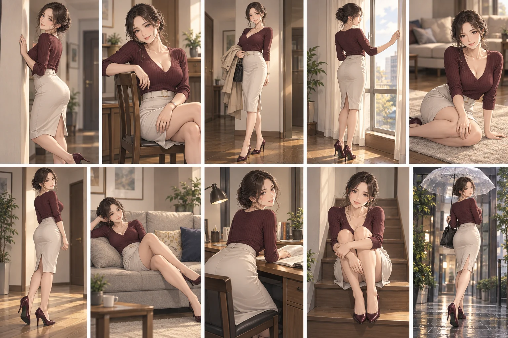
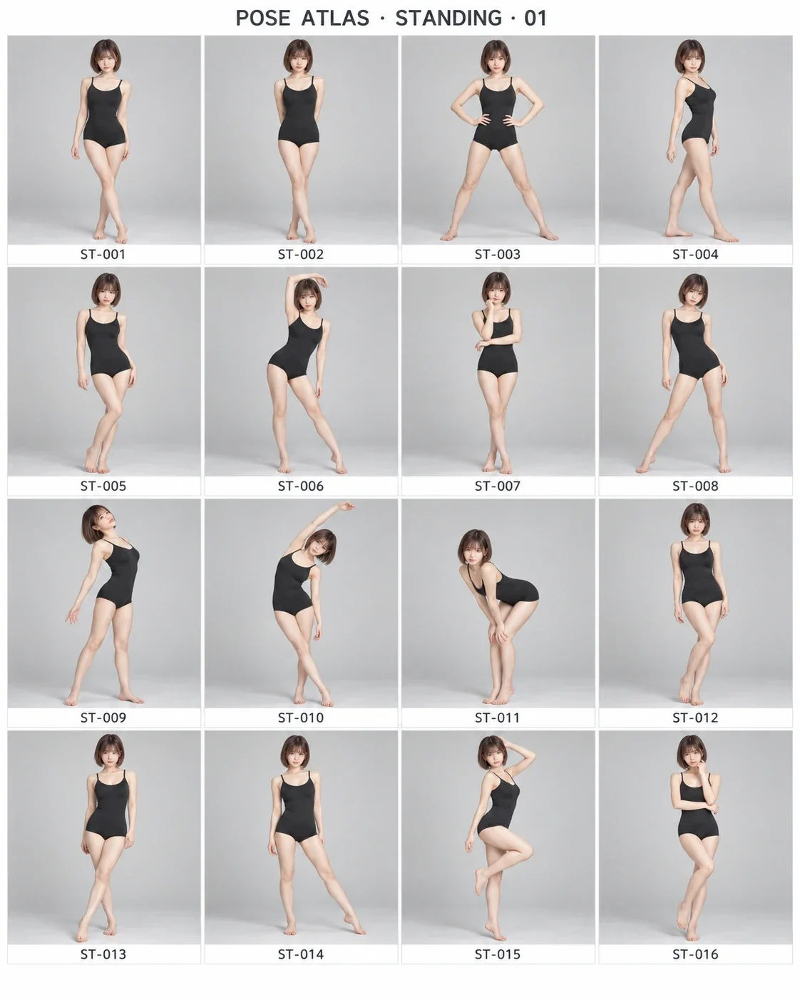

# Pose Atlas｜让姿势成为可调用的创作资产

出图不稳定，往往不是因为你没有灵感，而是因为你只能说“优雅一点”“换个姿势”，却无法准确描述身体的支撑、重心、腿部关系、躯干线条和镜头机位。

**Pose Atlas** 把单人姿势从模糊感觉变成可复用的结构：先按主题给你原创姿势方向；看中某个图里的姿势后，再用编号调出可直接交给出图工作流的完整身体结构提示词。

它适合人物摄影、AI 人像、角色设定、时尚编辑、插画分镜，以及任何“人物姿势总是差一点”的创作场景。

## 它解决什么问题？

- 同一个提示词反复出图，人物动作却总在随机漂移。
- 想要不同姿势，最后只得到换手、歪头、微笑的重复变体。
- 图里看到了好姿势，却不知道怎样用文字准确复刻。
- 姿势、镜头、场景和服装彼此脱节，画面缺少可执行的整体方向。

Pose Atlas 不替你决定人物设定，而是把“怎么站、怎么坐、重心落在哪里、身体朝哪里走”这件事讲清楚。

## 三步开始使用

### 1. 交给 Codex 安装

把下面这句话直接发给 Codex：

```text
请安装这个 Skill：https://github.com/yang0/PoseAtlas
```

安装后，它会成为你的单人姿势导演。

### 2. 根据主题，让 Skill 原创推荐姿势

不用先记编号。直接说人物主题、服装、场景、镜头或活动限制，Skill 会给出结构差异明确的原创 `NEW-*` 姿势候选，并同时说明支撑、腿部、重心、躯干、视线、景别和机位。

例如：

```text
推荐10个日式成人插画风格的姿势和拍摄角度
```

你会先获得 10 个成熟、非露骨的日式角色插画姿势与拍摄角度方向；选中后，可以把对应结构继续交给其他出图类 Skill 或图像生成工具执行。



> 无 ID 时，Pose Atlas 只做原创推荐，不会把图库姿势伪装成原创答案。

### 3. 看图后，用编号获取指定姿势的提示词

项目内有 30 张联系表，每张包含 16 个已编号姿势。打开本地 [图页目录](viewer/page_directory.html)，看中哪个姿势，就把 ID 交给 Skill。

```text
请读取 ST-011 的完整姿势结构，并给我用于出图的提示词
```

此时 Skill 会按该 ID 返回完整的身体结构：支撑、腿部、重心、骨盆、躯干、肩部、手臂、手部、头部、视线、轮廓、难度及推荐机位。若输入 Variant ID，例如 `ST-011-A`，会合并该变体的手臂、手部、头部与视线调整。



> 有 ID 时才进入图库查询；没有 ID 时才进行主题原创推荐。这让“灵感探索”和“精确复刻”保持清晰边界。

## 适合与哪些工作流结合？

- **图像生成 Skill**：先由 Pose Atlas 定姿势结构，再交给出图 Skill 完成角色、服装、场景与光线。
- **摄影策划**：把抽象的“松弛感”“力量感”“冷感都市”转成模特可执行的身体指令和机位建议。
- **角色 / IP 设定**：为同一角色建立稳定、可复用且不重复的姿势语言。
- **分镜与内容制作**：在多个画面中拉开支撑、重心、轮廓与动作强度，减少视觉重复。

## 项目包含什么？

- 480 个 Canonical Pose Family
- 1,440 个 Variant（每个母型 3 个末端变化）
- 30 张 WebP 联系表，共 480 个可浏览编号姿势
- 主题原创推荐与 Pose ID 精确查询两种路由

## 使用边界

Pose Atlas 只处理**单人姿势**。

- 未提供 Pose ID：输出原创 `NEW-*` 姿势，不引用图库。
- 提供 Canonical ID 或 Variant ID：返回对应的完整身体结构。
- Variant 只调整手臂、手部、头部与视线；不会改变母型的支撑、腿部、重心、骨盆和主要轮廓。

如果你也遇过“人物总是站得差不多，但不知道该怎样说”的问题，把 Pose Atlas 交给 Codex，从下一张图开始，把姿势说清楚。

## 作者

在 X 上关注 [@yang02010](https://x.com/yang02010)，获取更多 AI 创作与工作流实践。
